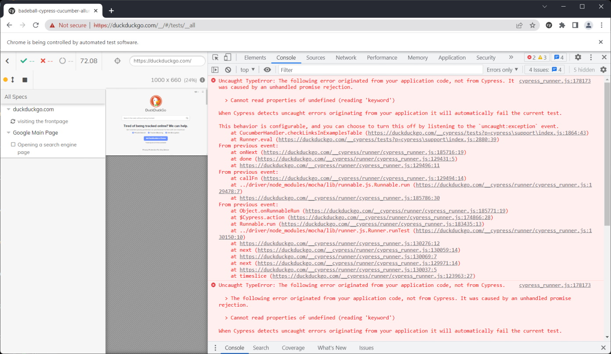

# Steps to duplicate

- npm install
- npm run cy:open
- run all tests
- see stacktrace in developer tools

```javascript
Uncaught TypeError: The following error originated from your application code, not from Cypress. It was caused by an unhandled promise rejection.

  > Cannot read properties of undefined (reading 'keyword')

When Cypress detects uncaught errors originating from your application it will automatically fail the current test.

This behavior is configurable, and you can choose to turn this off by listening to the `uncaught:exception` event.
    at CucumberHandler.checkLinksInExamplesTable (https://duckduckgo.com/__cypress/tests?p=cypress\support\index.ts:1862:43)
    at Runner.eval (https://duckduckgo.com/__cypress/tests?p=cypress\support\index.ts:2878:39)
From previous event:
    at onNext (https://duckduckgo.com/__cypress/runner/cypress_runner.js:185685:19)
    at done (https://duckduckgo.com/__cypress/runner/cypress_runner.js:129431:5)
    at https://duckduckgo.com/__cypress/runner/cypress_runner.js:129496:11
From previous event:
    at callFn (https://duckduckgo.com/__cypress/runner/cypress_runner.js:129494:14)
    at Test.../driver/node_modules/mocha/lib/runnable.js.Runnable.run (https://duckduckgo.com/__cypress/runner/cypress_runner.js:129478:7)
    at https://duckduckgo.com/__cypress/runner/cypress_runner.js:185755:30
From previous event:
    at Object.onRunnableRun (https://duckduckgo.com/__cypress/runner/cypress_runner.js:185740:19)
    at $Cypress.action (https://duckduckgo.com/__cypress/runner/cypress_runner.js:174847:28)
    at Test.Runnable.run (https://duckduckgo.com/__cypress/runner/cypress_runner.js:183404:13)
    at Runner.../driver/node_modules/mocha/lib/runner.js.Runner.runTest (https://duckduckgo.com/__cypress/runner/cypress_runner.js:130150:10)
    at https://duckduckgo.com/__cypress/runner/cypress_runner.js:130276:12
    at next (https://duckduckgo.com/__cypress/runner/cypress_runner.js:130059:14)
    at https://duckduckgo.com/__cypress/runner/cypress_runner.js:130069:7
    at next (https://duckduckgo.com/__cypress/runner/cypress_runner.js:129971:14)
    at https://duckduckgo.com/__cypress/runner/cypress_runner.js:130037:5
    at timeslice (https://duckduckgo.com/__cypress/runner/cypress_runner.js:123963:27)
```


